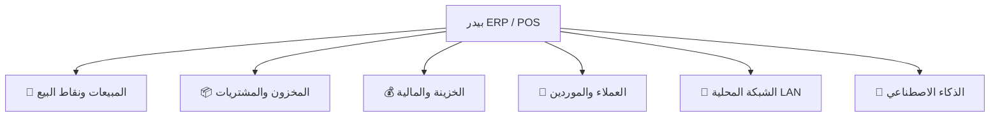

<div align="center">

# 🌾 بيدر — Beidar POS & ERP System
### نظام الجيل القادم لإدارة نقاط البيع، المخزون، الحسابات المالية، والموارد البشرية

[](https://github.com/wisam79/beidar-pos/actions/workflows/ci.yml)


<p align="center">
  <b>بيدر (Beidar)</b> هو نظام حاسوبي متكامل فائق السرعة وخفيف الوزن صُمم خصيصاً ليتجاوز قيود برامج نقاط البيع الكلاسيكية، جامعاً بين متانة الواجهة الخلفية بلغة <b>Go 1.25</b> وسلاسة الواجهة الأمامية الحديثة بلغة <b>React 18 + TypeScript</b>.
</p>

[الميزات](#-الميزات-الرئيسية-key-features) • [الهندسة والمعمارية](#-المعمارية-والهندسة-البرمجية-architecture) • [التقنيات المستخدمة](#-التقنيات-المستخدمة-tech-stack) • [التثبيت والتشغيل](#-التثبيت-والتشغيل-getting-started) • [التوثيق](#-فهرس-التوثيق-documentation)

---

</div>

## 🌟 لماذا نظام "بيدر"؟ (Why Beidar?)

تعتمد معظم الأنظمة التجارية التقليدية على قواعد بيانات ثقيلة وواجهات ويندوز كلاسيكية قديمة تؤدي للبطء وكثرة الأعطال. تم بناء **بيدر** وفق معايير برمجية حديثة لتقديم تجربة تشغيلية غير مسبوقة:

- ⚡ **إقلاع فوري واستهلاك خفيف:** يفتح التطبيق في أقل من ثانية واحدة ويستهلك أقل من `100MB RAM`.
- 🛡️ **دقة مالية مطلقة (Zero Floating-Point Error):** معالجة كافة الحسابات والضرائب والخصومات باستخدام نمط `domain.Amount` (أرقام صحيحة `int64` للقرش/السنت).
- 📡 **شبكة محلية ذاتية التكوين (Zero-Config LAN):** ربط أجهزة الكاشير المتعددة تلقائياً عبر بروتوكول `UDP Discovery` دون الحاجة لـ IP ثابت أو خوادم خارجية.
- 🖨️ **طباعة حرارية مباشرة صامتة (Direct Bitmap Spooling):** طباعة الإيصالات والملصقات وفواتير A4 فوراً باللغة العربية دون أي نوافذ منبثقة أو تشويه في الخطوط.
- 🤖 **مستشار أعمال ذكي (AI Business Advisor):** مدعوم بنماذج الذكاء الاصطناعي لتحليل المبيعات واقتراح خطط الشراء والتسعير الأمثل.
- 🔒 **تشفير مربوط بعتاد الجهاز (Device-Bound Security):** حماية التكوينات الحساسة والمفاتيح السحابية بتشفير AES معتمد على `MachineGuid`.

---

## ✨ الميزات الرئيسية (Key Features)



### 🛒 1. محرك نقطة البيع والمبيعات (POS & Sales Engine)
- **واجهة ثنائية (Dual-Pane):** فصل كامل بين سلة المشتريات (Cart) وشبكة المواد السريعة (Product Grid).
- **لوحة أرقام لمسية (Tactile Numpad):** دعم كامل للعمل بالشاشات اللمسية دون الحاجة للوحة مفاتيح خارجية.
- **التقاط صامت للباركود (Passive Barcode Listening):** قراءة سريعة من كافة قوارئ الـ USB/HID دون الحاجة لتحديد حقل الإدخال.
- **تعليق واسترجاع الفواتير (Parked Sales):** إمكانية تعليق فواتير متعددة والعودة إليها في أي وقت.
- **الدفع المقسم والتقسيط (Split & Installments):** تقسيم قيمة الفاتورة بين (نقدي، بطاقة، آجل) مع نظام إدارة الأقساط وجدولتها.
- **محرك الخصومات الذكي:** تطبيق كوبونات، خصومات بنسبة مئوية أو مبالغ مقطوعة، وعروض (اشتر X واحصل على Y).

### 📦 2. إدارة المخزون والمشتريات (Inventory & Procurement)
- **دورة حياة أوامر الشراء (Purchase Orders):** متابعة الشراء من مرحلة المسودة وحتى الاستلام المخزني وتسوية حساب المورد.
- **تتبع حركة المواد (Stock Movements):** سجل تدقيق مفصل لكل حركة إدخال، إخراج، تعديل، أو تالف مع هوية المسؤول.
- **تنبيهات النواقص التلقائية:** إشعارات فورية بالمنتجات التي وصلت إلى حد الطلب الأدنى (Low Stock Alerts).
- **مصمم ملصقات الباركود (Barcode Designer):** تصميم وطباعة ملصقات الأسعار والباركود بمقاسات مختلفة.

### 💰 3. الخزينة والورديات (Treasury & Financial Control)
- **إدارة الورديات (Shift Management):** فتح وإغلاق وردية الكاشير، تدقيق النقدية الفعلية، وحساب العجز أو الزيادة آلياً.
- **حركات الصندوق (Cash In / Out):** تسجيل السحبيات النقدية والإيداعات النثرية أثناء الوردية مع التوثيق.
- **المصروفات التشغيلية (Expenses):** تصنيف وتبويب المصروفات وحساب صافي الربح الحقيقي للمتجر.

### 👥 4. العملاء والموردين (CRM & Ledgers)
- **كشف حساب تفصيلي:** تتبع فواتير الآجل، دفعات السداد، وإجمالي ديون العملاء والتزامات الموردين.
- **تتبع الأقساط المتأخرة:** تنبيهات بمواعيد استحقاق الأقساط مع إمكانية تحصيل دفعات جزئية.
- **نقاط الولاء (Loyalty Points):** تجميع واستبدال نقاط المكافآت عند الشراء لزيادة ولاء العملاء.

### 📡 5. الخادم والشبكة المحلية (LAN Multi-Terminal)
- **خادم محلي مدمج (Embedded HTTP & WebSocket):** تحويل الجهاز الرئيسي إلى سيرفر محلي بضغطة زر.
- **اكتشاف تلقائي للأجهزة:** الكاشيرات الفرعية تكتشف السيرفر عبر البث المحلي دون الحاجة لإدخال الـ IP يدوياً.
- **حماية وإدارة الأجهزة:** إمكانية تعليق أو حظر أو استئناف أي جهاز متصل من لوحة تحكم المدير.
- **القارئ اللاسلكي (Mobile Scanner):** تحويل الهاتف الذكي إلى قارئ باركود يرسل للمبيعات مباشرة.

### 🤖 6. الذكاء الاصطناعي والمستشار المالي (AI Advisor)
- **تحليل المبيعات الفوري:** ربط آمن مع محركات الذكاء الاصطناعي (Gemini / Groq) لتحليل الأداء التجاري.
- **توصيات إعادة الطلب:** استنتاج المنتجات الراكدة وتوقع الاحتياجات المخزنية المستقبلية.
- **توليد التقارير التلخيصية:** تقديم ملخصات تنفيذية دورية للإدارة حول الأرباح والتحديات.

---

## 🏗️ المعمارية والهندسة البرمجية (Architecture)

تم بناء التطبيق بالاعتماد الصارم على **العمارة النظيفة (Clean Architecture v3)** لضمان عزل طبقات النظام وسهولة الصيانة:

```
[ Frontend: React 18 / Vite / Tailwind ]
                   │
                   ▼  (Wails IPC Bridge / REST LAN)
[ Handlers Layer: internal/handlers/ ]
                   │
                   ▼  (Domain Interfaces)
[ Service Layer: internal/service/ ]  ◄─── [ Financial Calculations & Business Logic ]
                   │
                   ▼  (Domain Repositories)
[ Repository Layer: internal/repository/ ]
                   │
                   ▼
[ Database: SQLite with WAL Mode (glebarez/sqlite) ]
```

### القواعد المعمارية الصارمة:
1. **فصل المسؤوليات:** تقتصر استعلامات `GORM` على طبقة `repository`، وتتولى طبقة `service` كافة العمليات الحسابية دون معرفة مباشرة بقاعدة البيانات.
2. **العمليات الذرية (Atomic DB Transactions):** تنفيذ عمليات البيع، الإرجاع، وتحديث الديون والمخزون داخل معاملات `Transaction` مؤمنة بالأقفال الصارمة (`Pessimistic Locking`).
3. **أمان الذاكرة وتزامن SQLite:** استخدام `WAL Mode` وحصر الاتصال بـ `MaxOpenConns(1)` لضمان عدم حدوث أخطاء `database is locked` عند التزامن الشبكي.
4. **الحماية ضد هجمات التوقيت:** مقارنة التوكنز والرموز السرية باستخدام `subtle.ConstantTimeCompare`.

---

## 🛠 التقنيات المستخدمة (Tech Stack)

### الواجهة الخلفية (Backend)
- **Go 1.25:** لغة برمجية فائقة الأداء في إدارة الذاكرة والتزامن.
- **Wails v2.12:** جسر التواصل الأصلي بين Go وواجهة سطح المكتب عبر Native Webview.
- **GORM 1.31 + SQLite (glebarez):** محرك قاعدة البيانات المحلي المكتوب بالكامل بـ Go (No CGO needed).
- **jung-kurt/gofpdf:** توليد فواتير الـ PDF فائقة الجودة مباشرة من الذاكرة.
- **x/crypto & PBKDF2:** تشفير كلمات المرور والرموز السرية.

### الواجهة الأمامية (Frontend)
- **React 18 + Vite 8:** بيئة بناء فائقة السرعة مع دعم التحديث المباشر (HMR).
- **TypeScript 5:** كتابة كود صارم وموثوق بالكامل بدون استخدام `any`.
- **Zustand 5:** إدارة الحالة العامة (Global State) لخفة وسرعة الاستجابة.
- **TanStack Query v5:** جلب وتخزين بيانات الخادم مؤقتاً (Server State Caching).
- **TanStack Virtual:** دعم عرض القوائم والجداول الضخمة دون استهلاك الذاكرة.
- **Tailwind CSS 3.4 + Radix UI:** مكونات بصرية عصرية ومتجاوبة بالكامل.
- **Lucide React Icons:** أيقونات متجهة عالية الدقة.

---

## 📂 هيكلية المشروع (Directory Structure)

```text
beidar/
├── build/                   # إعدادات Wails، أيقونات التطبيق، ومثبت Windows
├── docs/                    # التوثيق المعماري والأمني والأدلة الفنية
├── frontend/                # كود الواجهة الأمامية (React + TypeScript)
│   ├── e2e/                 # اختبارات المتصفح الشاملة (Playwright E2E)
│   └── src/
│       ├── components/      # المكونات المشتركة (Shadcn, Radix, Modals)
│       ├── core/            # واجهات الاتصال بـ Wails، الأنواع، وإدارة الصوت
│       ├── features/        # الوحدات الوظيفية (POS, Products, Finance, CRM...)
│       └── store/           # مخازن Zustand لإدارة الحالة
├── internal/                # النواة الخلفية بلغة Go
│   ├── core/domain/         # النماذج النقية والواجهات (Domain Entities & Interfaces)
│   ├── handlers/            # معالجات Wails المصدرة للواجهة
│   ├── network/             # خادم الشبكة المحلية LAN وبروتوكول الاكتشاف UDP
│   ├── repository/          # طبقة التخاطب مع SQLite و GORM
│   ├── service/             # منطق الأعمال والحسابات المالية
│   └── testutil/            # أدوات وبيانات الاختبارات الوهمية
├── pkg/                     # الحزم المساعدة (التشفير، الطباعة، الأمان، السجلات)
├── scripts/                 # سكربتات البناء المعتمدة وحقن الأسرار
├── app.go                   # نقطة حقن التبعيات وتهيئة الخدمات
├── main.go                  # مدخل تشغيل التطبيق وتكوين نافذة Wails
└── wails.json               # ملف إعدادات Wails
```

---

## 🚀 التثبيت والتشغيل (Getting Started)

### المتطلبات الأساسية
- تثبيت **[Go 1.25+](https://go.dev/dl/)**
- تثبيت **[Node.js 22+](https://nodejs.org/)**
- تثبيت **[Wails CLI](https://wails.io/docs/gettingstarted/installation)**:
  ```bash
  go install github.com/wailsapp/wails/v2/cmd/wails@latest
  ```

### 1. تشغيل التطبيق في وضع التطوير (Development)
```bash
# استنساخ المستودع
git clone https://github.com/wisam79/beidar-pos.git
cd beidar-pos

# تثبيت مكتبات الواجهة الأمامية
cd frontend && npm install && cd ..

# تشغيل التطبيق عبر Wails
wails dev
```

### 2. بناء النسخة التنفيذية (Production Build)
> **تنبيه:** يتم بناء التطبيق حصراً باستخدام سكربت البناء لضمان حقن المفاتيح وتجهيز الأصول:
```powershell
# بناء ملف التنفيذ ومثبت ويندوز
pwsh ./scripts/build.ps1 -Installer
```
المخرجات:
- ملف التشغيل: `build/bin/beidar-desktop.exe`
- مثبت البرامج: `build/bin/beidar-desktop-amd64-installer.exe`

---

## 🧪 منظومة الاختبارات والجودة (Testing & CI/CD)

يخضع المشروع لمنظومة فحص واختبارات مؤتمتة متكاملة على **GitHub Actions**:

```bash
# 1. تشغيل اختبارات الواجهة الخلفية مع كاشف التزامن (Race Detection)
go test -race ./...

# 2. تشغيل اختبارات الوحدة للواجهة الأمامية (270 اختبار)
cd frontend
npm run test:ci

# 3. تشغيل اختبارات المتصفح الشاملة (102 اختبار E2E)
npx playwright test
```

---

## 📚 فهرس التوثيق (Documentation)

| المستند | الوصف |
| :--- | :--- |
| 🤖 [AGENTS.md](AGENTS.md) | دليل الوكلاء الأذكياء وبروتوكول منع الهلوسة (Zero-Hallucination) |
| 🏛️ [docs/architecture.md](docs/architecture.md) | المعمارية التفصيلية وتدفق البيانات بين الطبقات |
| 🔒 [docs/security.md](docs/security.md) | معايير الأمان، التشفير المربوط بالعتاد، وإدارة الصلاحيات |
| 📡 [docs/lan_network.md](docs/lan_network.md) | بروتوكول الشبكة المحلية واكتشاف الأجهزة والربط المتعدد |
| 💾 [docs/database_and_concurrency.md](docs/database_and_concurrency.md) | ضبط التزامن، إدارة القفل، ووضع WAL في SQLite |
| 🧪 [docs/testing.md](docs/testing.md) | استراتيجيات الاختبارات الشاملة والمحاكاة |
| 📝 [CHANGELOG.md](CHANGELOG.md) | سجل الإصدارات والتحسينات المستمرة |

---

<div align="center">

**🌾 بيدر (Beidar) — نحو تجربة إدارة أعمال عصرية ومستقرة**

صُنع بحرفية وشغف لخدمة قطاع الأعمال ونقاط البيع الحديثة.

</div>
