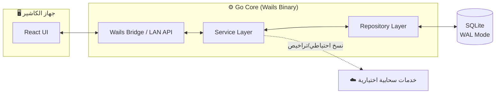
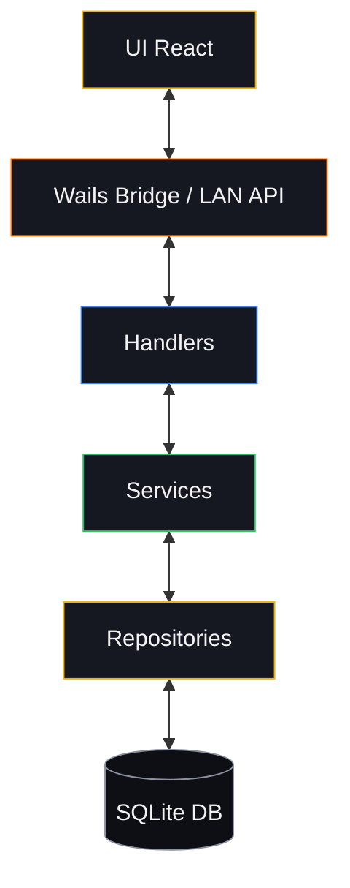
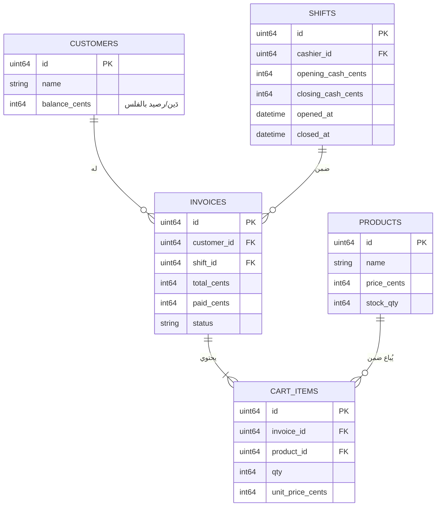
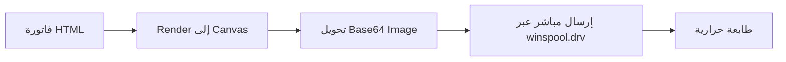

# 📐 design.md — الوثيقة المعمارية والبصرية الموحّدة

## نظام إدارة نقاط البيع لسطح المكتب (Desktop POS / ERP System)

> **الغرض من هذه الوثيقة:** مرجع هندسي وبصري ملزم لكل من يعمل على هذا المشروع — مطورين، مصممين، ومراجعي كود. أي انحراف عن القواعد المذكورة هنا (خصوصاً في القسمين 4 و5) يُعتبر خطأً معمارياً يجب تصحيحه قبل الدمج (merge).

**الإصدار:** 1.0 · **الحالة:** معتمد (Active) · **النطاق:** Desktop + LAN

---

## 📚 جدول المحتويات

1. [النظرة العامة والفلسفة المعمارية](#1-النظرة-العامة-والفلسفة-المعمارية)
2. [نظام التصميم والواجهات](#2-نظام-التصميم-والواجهات)
3. [العمارة البرمجية والهيكلية](#3-العمارة-البرمجية-والهيكلية)
4. [الهندسة المالية وقواعد البيانات](#4-الهندسة-المالية-وقواعد-البيانات)
5. [الأمان والحماية](#5-الأمان-والحماية)
6. [معمارية الطباعة والأجهزة الطرفية](#6-معمارية-الطباعة-والأجهزة-الطرفية)
7. [إدارة الأداء والتعافي الذاتي](#7-إدارة-الأداء-والتعافي-الذاتي)

---

## 1. النظرة العامة والفلسفة المعمارية

### 1.1 ملخص التطبيق

هذا النظام هو تطبيق **ERP/POS** مخصص لسطح المكتب، مصمم للعمل بكفاءة كاملة على جهاز واحد (Single Workstation) أو موزّعاً على عدة أجهزة كاشير ضمن **شبكة محلية (LAN)** دون الحاجة لاتصال إنترنت دائم. الفلسفة الأساسية: **"Local-First"** — قاعدة البيانات والمنطق التشغيلي يعملان محلياً بالكامل، بينما الاتصال بالخدمات السحابية (نسخ احتياطي، تراخيص، تقارير مركزية) يبقى اختيارياً وغير حاجب (non-blocking) لعمليات البيع.

### 1.2 التقنيات الأساسية (Tech Stack)

| الطبقة | التقنية | الملاحظات |
|---|---|---|
| **الخلفية (Backend)** | Go 1.25+ | لغة النواة، أداء عالٍ واستهلاك ذاكرة منخفض |
| **جسر سطح المكتب** | Wails v2 | ربط Go بواجهة الويب دون Electron/Chromium الكامل |
| **ORM** | GORM | مع قيود صارمة على مكان استخدامه (انظر §3.2) |
| **قاعدة البيانات** | SQLite (WAL Mode) | ملف محلي واحد، بدون خادم منفصل |
| **الأمامية (Frontend)** | React 18 + Vite | بناء سريع، Hot Module Reload |
| **التنسيق** | Tailwind CSS | Utility-first، مع Design Tokens مخصصة (§2.1) |
| **مكتبة المكوّنات** | Radix UI | Primitives غير مصممة مسبقاً، تُبنى عليها هوية بصرية خاصة |
| **إدارة الحالة** | Zustand | حالة عامة خفيفة (سلة الفاتورة، جلسة الكاشير) |
| **جلب البيانات** | React Query | Cache وإعادة المزامنة مع طبقة Wails/LAN API |

> [!IMPORTANT]
> اختيار **Wails بدل Electron** قرار معماري متعمد: يقلّل حجم التطبيق النهائي بشكل كبير ويعطي أداء إقلاع (cold start) أسرع، وهو أمر حرج لجهاز كاشير يُفتح ويُغلق عشرات المرات يومياً.

### 1.3 المبادئ المعمارية (Architectural Principles)

- **الفصل المطلق بين الطبقات (Clean Architecture):** لا يُسمح لأي طبقة بتجاوز الطبقة التي تليها مباشرة. الاعتماديات تتجه نحو الداخل فقط (`domain` لا يعرف شيئاً عن GORM أو Wails).
- **Zero Floating-Point Error Rate:** أي قيمة مالية تُخزَّن أو تُحسب كـ `float64` تُعتبر عيباً حرجاً (critical bug)، بلا استثناء. التفاصيل الكاملة في §4.1.
- **LAN Concurrency-Ready:** كل عملية كتابة (خصم مخزون، إضافة دَين، تسجيل دفعة) يجب أن تفترض مسبقاً أن كاشيراً آخر على نفس الشبكة قد ينفّذ نفس العملية في اللحظة ذاتها.

### 1.4 خريطة النظام على مستوى عالٍ



---

## 2. نظام التصميم والواجهات (Design System & UI/UX Architecture)

### 2.1 فلسفة البصريات (Visual Aesthetics)

النمط العام: **Dark Mode أساسي مع لمسات Glassmorphism خفيفة** على العناصر العائمة (Dialogs، Toasts، Dropdown)، وألوان تنبيهية زاهية (Vibrant Accents) تبرز فوراً على الخلفية الداكنة — مهم جداً في بيئة عمل قد تمتد لساعات طويلة تحت إضاءة محل تجاري.

**لوحة الألوان (Color Palette):**

| الاستخدام | اللون | القيمة |
|---|---|---|
| خلفية أساسية | Obsidian | `#0d0f14` |
| خلفية ثانوية (بطاقات) | Charcoal | `#151821` |
| اللون المميز الأساسي (Accent) | Amber/Gold | `#f5b301` |
| اللون المميز الثانوي | Safety Orange | `#ff6d00` |
| نجاح (Success) | `#22c55e` |
| خطر (Danger) | `#ef4444` |
| تحذير (Warning) | `#eab308` |
| معلومات (Info) | `#3b82f6` |
| نص أساسي | `#f2f2f2` |
| نص ثانوي/خافت | `#8b90a0` |

> [!NOTE]
> لون الـ Amber/Gold ليس اختياراً جمالياً فقط — في السوق العراقي يرتبط بصرياً بالدينار والمعاملات النقدية، مما يعزز الثقة البصرية أثناء عمليات الدفع.

**الطباعة (Typography):**

- **الخط العربي:** `Cairo` للعناوين، `Tajawal` للنصوص الطويلة والجداول (وضوح أعلى بأحجام صغيرة).
- **الخط اللاتيني/الأرقام:** `Inter` — تحديداً للأرقام المالية (Tabular Figures) لضمان محاذاة الأعمدة في الفواتير.
- **التدرج الهرمي:** العناوين الرئيسية `24–32px`، عناوين الأقسام `18–20px`، النص العادي `14–15px`، النصوص الثانوية `12–13px`.
- **الاتجاه:** RTL كامل بما في ذلك انعكاس الأيقونات الاتجاهية (أسهم، شريط التقدم).

### 2.2 قواعد شاشات نقاط البيع (POS UI/UX Rules)

- **Dual-Pane Layout:** الشاشة مقسّمة عمودياً بشكل صارم — الجزء الأكبر (يمين، بيئة RTL) لشبكة المنتجات (Product Grid)، والجزء الثابت العرض (يسار) للفاتورة الجارية (Cart) مع إجمالي دائم الظهور دون الحاجة للتمرير.
- **Touch-Friendly & Numpad:** كل عنصر تفاعلي بحد أدنى `44×44px` (معيار WCAG لأهداف اللمس)، مع لوحة أرقام (Numpad) برمجية مدمجة لإدخال الكميات والمبالغ المستلمة دون الاعتماد على لوحة مفاتيح فيزيائية.
- **الالتقاط الصامت للباركود (Passive Scanner Listening):** الماسح الضوئي يُعامَل كمحاكاة لوحة مفاتيح (HID) — يُستمع لتدفق الأحرف السريع المنتهي بـ Enter في مستمع عام على مستوى النافذة، بحيث يعمل بغضّ النظر عن العنصر الذي يحمل التركيز (focus) حالياً، طالما لا يوجد حقل نصي حر مفتوح صراحة.
- **Zen Mode:** زر واحد لإخفاء الشريط الجانبي والرأس بالكامل، وتكبير منطقة العمل لتغطي الشاشة كاملة — مخصص لساعات الذروة حيث كل بكسل يُحتسب.

### 2.3 نموذج كود: مستمع الباركود الصامت (React Hook)

```typescript
// hooks/usePassiveScanner.ts
import { useEffect, useRef } from "react";

const SCAN_TIMEOUT_MS = 50; // فارق زمني بين الأحرف يميّز الماسح عن الكتابة اليدوية

export function usePassiveScanner(onScan: (code: string) => void, enabled = true) {
  const buffer = useRef<string>("");
  const lastKeyTime = useRef<number>(0);

  useEffect(() => {
    if (!enabled) return;

    function handleKeydown(e: KeyboardEvent) {
      const target = e.target as HTMLElement;
      // لا نتدخل إن كان المستخدم يكتب فعلياً داخل حقل نصي حر
      const isFreeTextField =
        target.tagName === "TEXTAREA" ||
        (target.tagName === "INPUT" && target.dataset.scannerIgnore === "true");
      if (isFreeTextField) return;

      const now = Date.now();
      if (now - lastKeyTime.current > SCAN_TIMEOUT_MS) {
        buffer.current = ""; // فارق زمني كبير = كتابة يدوية، إعادة تصفير
      }
      lastKeyTime.current = now;

      if (e.key === "Enter") {
        if (buffer.current.length >= 4) onScan(buffer.current);
        buffer.current = "";
        return;
      }
      if (e.key.length === 1) buffer.current += e.key;
    }

    window.addEventListener("keydown", handleKeydown);
    return () => window.removeEventListener("keydown", handleKeydown);
  }, [enabled, onScan]);
}
```

### 2.4 المكونات الأساسية (Core UI Components Hierarchy)

- **الجداول الافتراضية (Virtual Tables):** عبر `@tanstack/react-virtual` لأي قائمة تتجاوز ~100 عنصر (سجل فواتير، كشف حساب عميل) — تفادياً لتجميد الواجهة.
- **Dialogs / Modals:** مبنية على `Radix Dialog` مع طبقة Glassmorphism (`backdrop-blur` + شفافية خلفية `~85%`) وإغلاق إلزامي بـ `Esc` أو نقرة خارجية إلا في حالات التأكيد الحرجة (حذف، إغلاق وردية).
- **Toast Notifications:** أعلى يسار الشاشة (بعيداً عن منطقة الفاتورة)، مدة عرض `3–4` ثوانٍ، مع تمييز لوني حسب النوع (نجاح/خطأ/تحذير).

---

## 3. العمارة البرمجية والهيكلية (Software Architecture & Layering)

### 3.1 رسم بياني للهيكلية



### 3.2 مواصفات الطبقات (Strict Layering Rules)

| الطبقة | المسؤولية | ممنوع فيها |
|---|---|---|
| **`handlers`** | استقبال الطلبات من Wails/LAN، تحويل DTOs، تمرير الأخطاء بصيغة موحدة للـ Client | أي منطق أعمال أو استعلام مباشر لقاعدة البيانات |
| **`service`** | منطق الأعمال، الحسابات المالية، التسويات، تنسيق عدة repositories ضمن معاملة واحدة | **استخدام `gorm.DB` مباشرة — ممنوع تماماً** |
| **`repository`** | الطبقة الوحيدة المسموح لها بالتعامل مع GORM و SQLite، بما فيها الأقفال (`FOR UPDATE`) | أي منطق أعمال أو قرار تسعير |
| **`domain`** | نماذج نقية (Pure Structs/Interfaces)، بلا أي استيراد لـ GORM أو Wails أو أي مكتبة خارجية | أي اعتمادية خارجية إطلاقاً |

> [!WARNING]
> استدعاء `gorm.DB` من داخل ملف في حزمة `service` هو **خط أحمر معماري**. أي Pull Request يحتوي على هذا النمط يُرفض تلقائياً في المراجعة، بغض النظر عن مدى "بساطة" العملية المزعومة.

### 3.3 نموذج كود: الفصل بين Service وRepository (Go)

```go
// domain/invoice.go — طبقة نقية، بلا أي اعتمادية خارجية
package domain

type InvoiceStatus string

const (
    InvoiceStatusOpen   InvoiceStatus = "open"
    InvoiceStatusPaid   InvoiceStatus = "paid"
    InvoiceStatusVoided InvoiceStatus = "voided"
)

type Invoice struct {
    ID         uint64
    CustomerID *uint64
    TotalCents int64
    PaidCents  int64
    Status     InvoiceStatus
}

// repository/invoice_repository.go — الطبقة الوحيدة التي تعرف GORM
package repository

type InvoiceRepository interface {
    GetForUpdate(ctx context.Context, tx *gorm.DB, id uint64) (*domain.Invoice, error)
    Save(ctx context.Context, tx *gorm.DB, inv *domain.Invoice) error
}

func (r *invoiceRepo) GetForUpdate(ctx context.Context, tx *gorm.DB, id uint64) (*domain.Invoice, error) {
    var inv domain.Invoice
    err := tx.Clauses(clause.Locking{Strength: "UPDATE"}).
        First(&inv, id).Error
    return &inv, err
}

// service/invoice_service.go — منطق الأعمال فقط، بلا gorm.DB مباشرة
package service

type InvoiceService struct {
    db       TxManager // واجهة تجريدية لإدارة المعاملات، وليست *gorm.DB
    invoices repository.InvoiceRepository
}

func (s *InvoiceService) SettlePayment(ctx context.Context, invoiceID uint64, amountCents int64) error {
    return s.db.WithTransaction(ctx, func(tx *gorm.DB) error {
        inv, err := s.invoices.GetForUpdate(ctx, tx, invoiceID)
        if err != nil {
            return err
        }
        inv.PaidCents += amountCents
        if inv.PaidCents >= inv.TotalCents {
            inv.Status = domain.InvoiceStatusPaid
        }
        return s.invoices.Save(ctx, tx, inv)
    })
}
```

---

## 4. الهندسة المالية وقواعد البيانات (Data & Financial Engineering)

### 4.1 تمثيل المبالغ المالية (Cent/Amount Pattern)

> [!IMPORTANT]
> **`float64` ممنوع منعاً باتاً** في أي حقل أو متغير يمثّل مبلغاً مالياً — سواء في قاعدة البيانات، في الذاكرة، أو في الـ DTOs المرسلة للواجهة. الأخطاء التراكمية في الفاصلة العائمة غير مقبولة في أي نظام محاسبي.

- كل مبلغ يُخزَّن كـ **`int64`** يمثّل أصغر وحدة نقدية (Fils/Cents).
- التقريب لأقرب فئة نقدية متداولة (مثلاً أقرب `250` دينار عراقي) يتم عبر دالة صريحة واحدة، لا عبر تقريب ضمني متناثر في الكود.

```go
// domain/money.go
package domain

// RoundToNearestDenomination يقرّب المبلغ (بالفلس) لأقرب فئة نقدية متداولة.
// مثال: denomination=25000 (250 IQD) يقرّب 3,412,600 → 3,412,500
func RoundToNearestDenomination(amountCents, denominationCents int64) int64 {
    if denominationCents <= 0 {
        return amountCents
    }
    remainder := amountCents % denominationCents
    if remainder*2 >= denominationCents {
        return amountCents - remainder + denominationCents
    }
    return amountCents - remainder
}

// ApplyDiscount تحسب المبلغ بعد خصم نسبة مئوية، بدقة صحيحة (integer-only)
func ApplyDiscount(amountCents int64, discountBps int64) int64 {
    // discountBps بوحدة "نقطة أساس" (10000 = 100%) لتفادي الكسور العشرية
    return amountCents - (amountCents*discountBps)/10000
}
```

### 4.2 تصميم قاعدة البيانات والتزامن (SQLite Concurrency)

- **WAL Mode مفعّل إلزامياً** (`PRAGMA journal_mode=WAL`) لسماح قراءات متزامنة أثناء الكتابة.
- **`MaxOpenConns(1)`** على اتصال الكتابة تحديداً — SQLite لا يدعم كتابات متزامنة حقيقية، وتقييد الاتصال يمنع أخطاء `database is locked` بدلاً من معالجتها بإعادة المحاولة العشوائية.
- قناة قراءة منفصلة (Read-only connection pool) يمكن أن تبقى بعدة اتصالات لتفادي حجب الاستعلامات القرائية الثقيلة (تقارير) خلف عمليات الكتابة السريعة.

**أبرز نقاط المخطط الكياني (Entity-Relationship Highlights):**



### 4.3 التحديث الذري والأنماط المعاملاتية (Atomic Transactions)

> [!WARNING]
> أي تحديث لحقل تراكمي (مخزون، رصيد دَين، نقاط ولاء) عبر نمط **"اقرأ ثم اكتب"** (`Read-Modify-Write`) في كود Go مباشرة — بدل تعبير SQL ذري — يُعتبر عيباً معمارياً يفتح الباب أمام Race Conditions في بيئة LAN متعددة الكاشيرات.

**الاستخدام الحصري لـ `gorm.Expr` للتحديثات التراكمية:**

```go
// ❌ خطأ — عرضة لـ Race Condition بين قراءة القيمة وكتابتها
var product domain.Product
tx.First(&product, productID)
product.StockQty -= qty
tx.Save(&product)

// ✅ صحيح — تحديث ذري على مستوى قاعدة البيانات نفسها
tx.Model(&domain.Product{}).
    Where("id = ?", productID).
    Update("stock_qty", gorm.Expr("stock_qty - ?", qty))
```

- **الأقفال المتشائمة (Pessimistic Locking):** تُستخدم عبر `GetForUpdate` (انظر §3.3) في أي تسلسل عمليات يتطلب قراءة الحالة الحالية قبل اتخاذ قرار منطقي (مثل: "هل الرصيد كافٍ لإتمام البيع بالدَين؟") — وهنا التحديث الذري وحده لا يكفي لأن القرار نفسه يعتمد على القيمة المقروءة.
- **الأقفال المتفائلة (Optimistic Locking):** تُستخدم في عمليات أقل حساسية (تحديث بيانات عميل وصفية) عبر عمود `version` يُتحقق منه عند الحفظ.

---

## 5. الأمان والحماية (Security & Hardening Protocol)

### 5.1 التشفير والحماية الإقليمية

- **أسرار API والخدمات السحابية:** تُشفَّر بالاعتماد على هوية العتاد (`secureconfig`)، عبر ربط مفتاح التشفير بـ `Windows MachineGuid` — بحيث لا يمكن نسخ ملف الإعدادات المشفّر وتشغيله على جهاز آخر.
- **أرقام PIN وكلمات السر:** تُجزّأ (hash) حصرياً عبر `bcrypt` بعامل تكلفة (cost factor) لا يقل عن `12`. لا تُخزَّن أو تُسجَّل نصوصاً صريحة تحت أي ظرف.

### 5.2 الحماية من الثغرات (Vulnerability Protection)

| الثغرة | آلية الحماية |
|---|---|
| **CSV Formula Injection** | أي خلية تصدير تبدأ بـ `=` أو `+` أو `-` أو `@` تُسبَق تلقائياً بفاصلة علوية (`'`) قبل الكتابة للملف |
| **Brute-Force على PIN** | **Tarpitting**: تأخير أسي متصاعد بعد كل محاولة فاشلة (`1s → 2s → 4s → 8s...`) بدلاً من قفل الحساب كلياً — يحافظ على تجربة استخدام معقولة للمستخدم الشرعي بينما يجعل الهجوم الآلي غير مجدٍ عملياً |
| **تسريب PII عبر السجلات** | **PII Masking**: أي حقل حساس (رقم هاتف، اسم كامل) يُعتّم جزئياً (`07xx***1234`) قبل كتابته في أي ملف سجل (log) |
| **تجاوز الصلاحيات عبر LAN** | **LAN Authorization**: كل طلب كتابة/حذف قادم عبر الشبكة المحلية يُتحقق من صلاحياته في `handlers` قبل الوصول لـ `service` — لا يُعتمد على إخفاء الواجهة كإجراء أمني (Security by obscurity مرفوض) |

```go
// security/csv_sanitize.go
func SanitizeCSVCell(value string) string {
    if len(value) == 0 {
        return value
    }
    dangerous := []byte{'=', '+', '-', '@'}
    for _, ch := range dangerous {
        if value[0] == ch {
            return "'" + value
        }
    }
    return value
}
```

> [!WARNING]
> **Tarpitting لا يعني عدم وجود حد أقصى نهائي.** بعد عدد محاولات كبير جداً (مثلاً 20 محاولة متتالية) يُسجَّل الحدث كإنذار أمني (Security Alert) في السجل المركزي حتى لو استمر النظام بقبول محاولات جديدة، لضمان قابلية التتبع اللاحق.

---

## 6. معمارية الطباعة والأجهزة الطرفية (Hardware & Printing Architecture)

### 6.1 الطباعة الحرارية (Thermal Receipt Printing)

**الطباعة الصامتة بالصور (Silent Bitmap Print):** لتفادي حوارات الطباعة القياسية لنظام التشغيل (بطيئة، تكسر إيقاع الكاشير)، يتبع النظام المسار التالي:



- لا استدعاء لأي حوار نظام تشغيل — الطباعة تصدر مباشرة من الخلفية (Go) عبر واجهة `winspool.drv` على Windows.
- هذا النهج يضمن أيضاً أن شكل الفاتورة المطبوعة مطابق حرفياً لما يظهر في معاينة الشاشة، لأن كليهما يُولَّد من نفس مصدر الـ HTML/Canvas.

### 6.2 طباعة الملصقات (Barcode Labels)

طباعة ملصقات الباركود تسلك مساراً مختلفاً ومقصوداً — تتم مباشرة من الـ Frontend عبر `iframe` مخفي واستدعاء `window.print()` القياسي للمتصفح، نظراً لأن طابعات الملصقات غالباً ما تُدار عبر تعريفات نظام التشغيل القياسية التي تتعامل بشكل أفضل مع أبعاد الملصق الدقيقة (Label Size) من مسار الـ Bitmap المباشر المستخدم للإيصالات.

---

## 7. إدارة الأداء والتعافي الذاتي (Performance & Resilience)

### 7.1 الأداء والذاكرة

- **تفريغ الحمولات الثقيلة من استعلامات القوائم:** أي حقل يحتوي صوراً بصيغة Base64 (صورة منتج، شعار) يُستثنى صراحة من استعلامات الجداول والقوائم (`SELECT` محدد الأعمدة، لا `SELECT *`) ولا يُجلب إلا عند فتح تفاصيل العنصر بمفرده.
- **`useDeferredValue` والـ Debouncing:** أي حقل بحث حي (بحث عن منتج، بحث عن عميل) يستخدم `useDeferredValue` من React لتفادي إعادة render مع كل ضغطة مفتاح، مع Debounce إضافي (~200ms) قبل إطلاق أي استعلام فعلي للخلفية.

### 7.2 التعافي الذاتي (Self-Healing & Fallbacks)

- **إعادة المحاولة بتراجع أسي (Exponential Backoff):** أي اتصال بخدمة سحابية اختيارية (نسخ احتياطي، تحقق ترخيص) يُعاد المحاولة عليه تلقائياً بفواصل زمنية متصاعدة، دون حجب أي عملية بيع محلية أثناء الانتظار.
- **البديل البرمجي عند تعطل الأجهزة (Software Fallback):** إن فشلت الطابعة الحرارية (غير متصلة، دون ورق)، يُحوَّل مسار الفاتورة تلقائياً إلى ملف PDF محفوظ محلياً، مع إشعار واضح للكاشير بإمكانية إعادة الطباعة لاحقاً بمجرد استعادة الطابعة — **لا تتوقف عملية البيع أبداً بسبب عطل في جهاز طرفي.**

> [!IMPORTANT]
> المبدأ الحاكم لكامل هذا القسم: **فشل أي مكوّن ثانوي (طابعة، اتصال سحابي) يجب ألا يمنع إتمام عملية بيع واحدة.** فقط فشل قاعدة البيانات المحلية نفسها يُعتبر عطلاً حرجاً يوقف النظام.

---

*نهاية الوثيقة — design.md*
